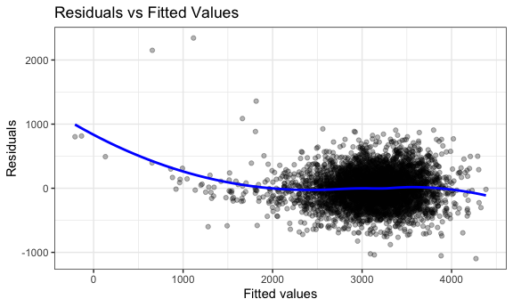
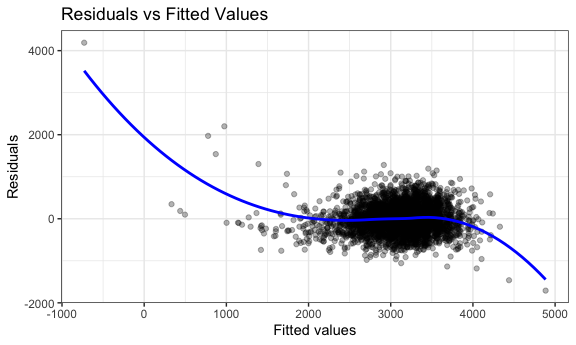
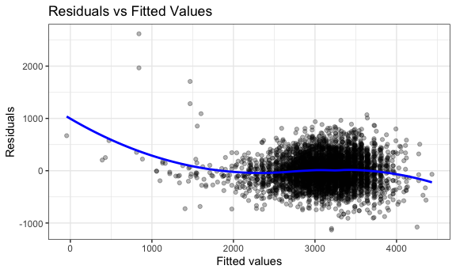

p8105_hw6_fw2394
================
Fang Wang
2024-11-29

# Load libraries and setting up

# Problem 1

## Load data

``` r
weather_df = 
  rnoaa::meteo_pull_monitors(
    c("USW00094728"),
    var = c("PRCP", "TMIN", "TMAX"), 
    date_min = "2017-01-01",
    date_max = "2017-12-31") %>%
  mutate(
    name = recode(id, USW00094728 = "CentralPark_NY"),
    tmin = tmin / 10,
    tmax = tmax / 10) %>%
  select(name, id, everything())
```

    ## using cached file: /Users/fangwang/Library/Caches/org.R-project.R/R/rnoaa/noaa_ghcnd/USW00094728.dly

    ## date created (size, mb): 2024-11-29 14:12:55.635623 (8.667)

    ## file min/max dates: 1869-01-01 / 2024-11-30

*The dataset contains 365 observations and 6 variables.*

## run linear regression between tmax and tmin

``` r
lm(tmax ~ tmin, data = weather_df) |> 
  broom::tidy() |> 
  knitr::kable(digits = 3)
```

| term        | estimate | std.error | statistic | p.value |
|:------------|---------:|----------:|----------:|--------:|
| (Intercept) |    7.209 |     0.226 |    31.847 |       0 |
| tmin        |    1.039 |     0.017 |    61.161 |       0 |

``` r
lm(tmax ~ tmin, data = weather_df) |> 
  broom::glance(model) |> 
  knitr::kable(digits = 3)
```

| r.squared | adj.r.squared | sigma | statistic | p.value |  df |   logLik |      AIC |      BIC | deviance | df.residual | nobs |
|----------:|--------------:|------:|----------:|--------:|----:|---------:|---------:|---------:|---------:|------------:|-----:|
|     0.912 |         0.911 | 2.938 |  3740.663 |       0 |   1 | -910.286 | 1826.572 | 1838.272 | 3133.449 |         363 |  365 |

## write a function to draw a bootstrap sample

``` r
boot_sample = function (df){
  sample_frac(df, replace = TRUE)
}
```

## draw one boot sample and run linear model

``` r
boot_sample(weather_df) |> 
  lm(tmax ~ tmin, data =_) |> 
  broom::tidy() |> 
  knitr::kable(digits = 3)
```

| term        | estimate | std.error | statistic | p.value |
|:------------|---------:|----------:|----------:|--------:|
| (Intercept) |    7.213 |     0.227 |    31.766 |       0 |
| tmin        |    1.028 |     0.017 |    61.434 |       0 |

``` r
# Unless I set seed, otherwise the estimates and slopes are different for each draw.

boot_sample(weather_df) |> # draw 365 observations but may draw the same observations more than once. 
  ggplot(aes(x = tmin, y = tmax)) + 
  geom_point(alpha = .5) +
  stat_smooth(method = "lm") +
  labs(title = "Association Between Minimal Temperature (tmin) and Maximum Temperature (tmax) ")
```

    ## `geom_smooth()` using formula = 'y ~ x'


*The linear regression line has a positive slope, meaning there is a
positive relationship between the minimal temperature and the maximum
temperature. In simpler terms, as the minimum temperature increases, the
maximum temperature tends to increase as well.*

## draw 5000 bootstrap samples

``` r
boot_straps =
  tibble(strap_number = 1:5000) |> 
  mutate(
    strap_samples = map (strap_number, \(i) boot_sample(df = weather_df))
  )
```

## Calculate estimates and rsquare from 5000 bootstrap samples

``` r
bootstrap_results = 
  boot_straps |> 
  mutate(
    models = map(strap_samples, \(df) lm(tmax ~ tmin, data = df) ),
    results_estimates = map(models, broom::tidy),
    rsquare = map(models, broom::glance))|> 
  select(-strap_samples, -models) |> 
  unnest(results_estimates, rsquare) 
```

    ## Warning: `unnest()` has a new interface. See `?unnest` for details.
    ## ℹ Try `df %>% unnest(c(results_estimates, rsquare))`, with `mutate()` if
    ##   needed.

``` r
estimate_rsquare_df = bootstrap_results |> 
  janitor::clean_names() |> 
  select (strap_number, term, estimate, r_squared)
```

*The dataset contains 10000 observations and 4 variables, including
strap_number, term, estimate and r_squared.*

## Change format of the dataset for plotting:

``` r
estimate_rsquare_df_wider = estimate_rsquare_df |> 
  pivot_wider(
    names_from = term, 
    values_from = estimate
  ) |> 
  rename(
    estimate_intercept = `(Intercept)`,  # Wrap (Intercept) in backticks
    estimate_beta = tmin
  )
```

## Plot the distribution of log(β0 \* β1)

``` r
estimate_rsquare_df_wider |> 
  ggplot(aes(x = log(estimate_intercept*estimate_beta)))+
  geom_histogram(bins =30, color = "black", fill = "pink") +
  labs (
    title = "Distribution of log(β0 * β1) for 5000 bootstrap samples",
    x = "log(β0 * β1)",
    y = "Frequency"
  ) +
  theme(axis.text.x = element_text(hjust = 1)) +
  theme(plot.title=element_text(size=18, face="bold"))+
  theme(plot.title = element_text(hjust = 0.5))
```


*The center of the distribution indicates that the product of β₀ and β₁
is most likely around 2.00, and the histogram suggests that this
estimate is consistent with relatively little spread.*

## Plot the distribution of rsquare

``` r
estimate_rsquare_df_wider |> 
  ggplot(aes(x = r_squared))+
  geom_histogram(bins =30, color = "black", fill = "lightblue") +
  labs (
    title = "Distribution of R square for 5000 bootstrap samples",
    x = "R square",
    y = "Frequency"
  ) +
  theme(axis.text.x = element_text(hjust = 1)) +
  theme(plot.title=element_text(size=18, face="bold"))+
  theme(plot.title = element_text(hjust = 0.5))
```


*The model seems to perform consistently well across bootstrap samples,
with an average R² of around 0.91, indicating that it explains 91% of
the variance in the response variable. The narrow distribution and
symmetry suggest reliable model performance, and the relatively high R²
values suggest strong predictive power.*

## calcuate 95% confidence interval for rsquare

``` r
estimate_rsquare_df_wider |> 
  summarize(
    ci_lower = quantile(r_squared, 0.025), 
    ci_upper = quantile(r_squared, 0.975))
```

    ## # A tibble: 1 × 2
    ##   ci_lower ci_upper
    ##      <dbl>    <dbl>
    ## 1    0.894    0.927

*95% confidence interval for rsquare is (0.894, 0.927).*

## calcuate 95% confidence interval for log(β0 \* β1)

``` r
estimate_rsquare_df_wider |> 
summarize(
    ci_lower = quantile(log(estimate_intercept*estimate_beta), 0.025), 
    ci_upper = quantile(log(estimate_intercept*estimate_beta), 0.975))
```

    ## # A tibble: 1 × 2
    ##   ci_lower ci_upper
    ##      <dbl>    <dbl>
    ## 1     1.97     2.06

*95% confidence interval for log(β0_β1) is (1.97, 2.06).*

# Problem 2

## Load and clean data

``` r
homicide = read.csv("./data/homicide-data.csv")|> 
  mutate(city_state = paste(city, state, sep =",")) |> 
  filter(!(city_state%in%c("Dallas,TX", "Phoenix,AZ", "Kansas City,MO", "Tulsa,AL"))) |> 
  mutate(victim_age = as.numeric(victim_age)) |> 
  filter (victim_race %in% c("White", "Black")) |> 
  mutate(
    solved = case_when(
    disposition %in% c("Closed without arrest", "Closed by arrest") ~ 1, # Solved cases
    disposition == "Open/No arrest" ~ 0,                                # Unsolved cases
    TRUE ~ NA_integer_                                                  # Default (optional, NA if unexpected values)
    )
  )
```

    ## Warning: There was 1 warning in `mutate()`.
    ## ℹ In argument: `victim_age = as.numeric(victim_age)`.
    ## Caused by warning:
    ## ! NAs introduced by coercion

*The dataset contains 39693 observations and 14 variables.*

## run glm for Baltimore, MD

``` r
# filter data for Baltimore,MD
baltimore_df = homicide |> 
  filter(city_state == "Baltimore,MD") |> 
  mutate(victim_sex = as.factor (victim_sex),
         victim_race = as.factor (victim_race))

# run generalized linear models
baltimore_model = glm(solved ~ victim_age + victim_sex + victim_race, family = binomial(), data = baltimore_df)

## calculate the odds ratio in the model
model_summary = tidy(baltimore_model, conf.int = TRUE, exponentiate = TRUE)
model_summary
```

    ## # A tibble: 4 × 7
    ##   term             estimate std.error statistic  p.value conf.low conf.high
    ##   <chr>               <dbl>     <dbl>     <dbl>    <dbl>    <dbl>     <dbl>
    ## 1 (Intercept)         1.94    0.174        3.80 1.42e- 4    1.38      2.74 
    ## 2 victim_age          0.995   0.00325     -1.60 1.10e- 1    0.988     1.00 
    ## 3 victim_sexMale      0.355   0.143       -7.26 3.74e-13    0.267     0.468
    ## 4 victim_raceWhite    2.46    0.180        4.99 6.04e- 7    1.73      3.52

## Extract the odds ratio for male vs. female victims

``` r
male_female_odds_ratio = model_summary|> 
  filter(term == "victim_sexMale") |> 
  select(estimate, conf.low, conf.high) |> 
  janitor::clean_names()

male_female_odds_ratio
```

    ## # A tibble: 1 × 3
    ##   estimate conf_low conf_high
    ##      <dbl>    <dbl>     <dbl>
    ## 1    0.355    0.267     0.468

*The estimate of victim_sexMale is 0.355 that indicates the odds of
solving homicides for male victims are 64.5% lower than for female
victims (1−0.355=0.645), holding all other factors constant. Its
confidence Interval (0.267, 0.468) means the true odds are estimated to
be between 0.267 and 0.468. p-value: 3.74×10^(−13), Highly statistically
significant (p\<0.001).*

## run glm for each city

``` r
homicide_cities = homicide|> 
  group_by(city_state) |> 
  nest() |>  # a nested list-column
  mutate(
    models = map(data, ~glm(solved ~ victim_age + victim_sex + victim_race, family = binomial(), data =.x)),
    results = map (models, ~tidy(.x, conf.int = TRUE, exponentiate = TRUE))
  ) |> 
  select (city_state, results) |> 
  unnest(results) |> 
  filter(term == "victim_sexMale") |> 
  select(city_state, term, estimate, conf.low, conf.high) |> 
  janitor::clean_names()
```

    ## Warning: There were 43 warnings in `mutate()`.
    ## The first warning was:
    ## ℹ In argument: `results = map(models, ~tidy(.x, conf.int = TRUE, exponentiate =
    ##   TRUE))`.
    ## ℹ In group 1: `city_state = "Albuquerque,NM"`.
    ## Caused by warning:
    ## ! glm.fit: fitted probabilities numerically 0 or 1 occurred
    ## ℹ Run `dplyr::last_dplyr_warnings()` to see the 42 remaining warnings.

*Homicide_cities contains 47 observations/cities and 5 variables,
including state_city, term, estimate, conf_low and conf_high.*

## plot ORs and Cls

``` r
homicide_cities |> 
  ggplot (aes(x = reorder(city_state, estimate), y = estimate)) +
  geom_point() + 
  geom_errorbar(aes(ymin = conf_low, ymax= conf_high)) + # Add confidence intervals
  geom_hline(yintercept = 1, linetype = 'dashed', color = 'gray') + # Add a dashed line at odds ratio = 1
  labs(x = 'City', y = 'Odds Ratio', title = 'Estimated Odds Ratios and Confidence Intervals for Each City')+  # Labels and title
  theme(axis.text.x = element_text(angle = 90, hjust = 1))  
```


*The plot provides a comparison of the odds ratios for different cities,
allowing us to see which cities have a higher or lower likelihood of
experiencing the event compared to the baseline. Cities like New York,
NY and Long Beach, CA have odds ratios less than 1, which suggests that
solving homicides is less likely in these cities compared to the
reference group. However, cities like Fresno, CA and Minneapolis, MN
have odds ratios greater than 1, meaning that the event is less likely
in these cities compared to the reference group.*

# Problem 3

## load and clean data

``` r
birthweight = read.csv("data/birthweight.csv") |> 
  mutate(
    babysex = case_when(
      babysex == 1 ~ "male",     
      babysex == 2 ~ "female",    
      TRUE ~ NA_character_        
    ),
    frace = case_when(     
      frace == 1 ~ "White",
      frace == 2 ~ "Black",
      frace == 3 ~ "Asian",
      frace == 4 ~ "Puerto Rican",
      frace == 8 ~ "Other",
      frace == 9 ~ "Unknown",
      TRUE ~ NA_character_
    ),
    mrace = case_when(   
      mrace == 1 ~ "White", 
      mrace == 2 ~ "Black", 
      mrace == 3 ~ "Asian", 
      mrace == 4 ~ "Puerto Rican",
      mrace == 8 ~ "Other",
      TRUE ~ NA_character_
    )
  ) |> 
  mutate(babysex = as.factor(babysex), 
         frace =as.factor(frace),
         mrace = as.factor(mrace))
```

*The dataset contains 4342 observations and 20 variables.*

## check missing data

``` r
colSums(is.na(birthweight))
```

    ##  babysex    bhead  blength      bwt    delwt  fincome    frace  gaweeks 
    ##        0        0        0        0        0        0        0        0 
    ##  malform menarche  mheight   momage    mrace   parity  pnumlbw  pnumsga 
    ##        0        0        0        0        0        0        0        0 
    ##    ppbmi     ppwt   smoken   wtgain 
    ##        0        0        0        0

*There are no missing values in the dataset.*

## run a regression model by including all direct and indirect factors

``` r
# Basic regression model
birthweight_model_1 = lm(bwt ~ babysex + bhead + blength + delwt + fincome + gaweeks + malform + 
                          menarche + mheight + momage + mrace + parity + pnumlbw + pnumsga + 
                          ppbmi + ppwt + smoken + wtgain, data = birthweight)

# Check summary of the model
summary(birthweight_model_1) |> 
  broom::tidy()
```

    ## # A tibble: 18 × 5
    ##    term               estimate std.error statistic   p.value
    ##    <chr>                 <dbl>     <dbl>     <dbl>     <dbl>
    ##  1 (Intercept)       -6321.      659.       -9.59  1.41e- 21
    ##  2 babysexmale         -28.7       8.46     -3.39  7.08e-  4
    ##  3 bhead               131.        3.45     37.9   7.89e-272
    ##  4 blength              74.9       2.02     37.1   1.63e-261
    ##  5 delwt                 4.10      0.395    10.4   5.31e- 25
    ##  6 fincome               0.290     0.179     1.62  1.06e-  1
    ##  7 gaweeks              11.6       1.46      7.90  3.65e- 15
    ##  8 malform               9.86     70.6       0.140 8.89e-  1
    ##  9 menarche             -3.61      2.89     -1.25  2.12e-  1
    ## 10 mheight               9.97     10.3       0.968 3.33e-  1
    ## 11 momage                0.755     1.22      0.618 5.36e-  1
    ## 12 mraceBlack          -63.3      43.2      -1.47  1.43e-  1
    ## 13 mracePuerto Rican   -25.3      45.9      -0.551 5.81e-  1
    ## 14 mraceWhite           73.9      42.8       1.73  8.44e-  2
    ## 15 parity               95.7      40.5       2.36  1.81e-  2
    ## 16 ppbmi                 4.56     14.9       0.307 7.59e-  1
    ## 17 ppwt                 -3.51      2.61     -1.34  1.79e-  1
    ## 18 smoken               -4.83      0.586    -8.24  2.29e- 16

*The coefficients represent the estimated effects of each predictor
variable on the response variable (bwt or birthweight). The intercept is
the estimated birthweight when all predictor variables are set to zero.
babysexmale is -28.6 which means male babies are expected to weigh 28.68
grams less than female babies, holding all other variables constant. The
p-value is 0.000708, indicating this difference is statistically
significant at the 0.001 level (highly significant). The coefficient for
head circumference (bhead) 130.80 means that for every 1 cm increase in
head circumference, the birthweight is expected to increase by 130.80
grams, holding other variables constant. The p-value is very small (p \<
2e-16), indicating strong statistical significance. The coefficient for
birth length (blength) 74.91 means that for every 1 cm increase in birth
length, birthweight is expected to increase by 74.91 grams. This is also
statistically significant with a very small p-value (p \< 2e-16). The
coefficient for mother’s weight at delivery (delwt) 4.10 means that for
each pound increase in maternal weight, the baby’s birthweight increases
by 4.10 grams, and this is statistically significant (p \< 2e-16). The
coefficient for gestational age in weeks (gaweeks) 11.57 means that for
every additional week of gestational age, birthweight is expected to
increase by 11.57 grams. This is statistically significant with a very
small p-value (p \< 2e-16). The value of -4.83 means that for every
additional cigarette smoked per day, birthweight decreases by 4.83
grams, and this is statistically significant with a very small p-value
(p \< 2e-16). However, variables like fincome, malform, menarche,
mheight, momage, and mrace do not appear to have a significant impact on
birthweight in this model.*

## add predictions and residuals

``` r
birthweight_1 = birthweight |> 
  add_predictions(birthweight_model_1) |> 
  add_residuals(birthweight_model_1)
```

## plot residuals vs fitted values

``` r
ggplot(birthweight_1, aes(x = pred, y = resid)) +
  geom_point(alpha = 0.3) +
  geom_smooth(method = "loess", color = "blue", se = FALSE) +
  labs(x = "Fitted values", y = "Residuals", title = "Residuals vs Fitted Values")
```

    ## `geom_smooth()` using formula = 'y ~ x'


*The plot shows a curved pattern in the residuals (the blue line is
curved). This suggests non-linearity in the relationship between the
predictors and the outcome (birthweight). Therefore, this model may not
be fully capturing the underlying patterns in the data.*

## run regression using main predictors

``` r
birthweight_model_2 = lm(bwt ~ blength + gaweeks, data = birthweight)
summary(birthweight_model_2)|> 
  broom::tidy()
```

    ## # A tibble: 3 × 5
    ##   term        estimate std.error statistic  p.value
    ##   <chr>          <dbl>     <dbl>     <dbl>    <dbl>
    ## 1 (Intercept)  -4348.      98.0      -44.4 0       
    ## 2 blength        129.       1.99      64.6 0       
    ## 3 gaweeks         27.0      1.72      15.7 2.36e-54

``` r
birthweight_2 = birthweight |> 
  add_predictions(birthweight_model_2) |>
  add_residuals(birthweight_model_2)

ggplot(birthweight_2, aes(x = pred, y = resid)) +
  geom_point(alpha = 0.3) +
  geom_smooth(method = "loess", color = "blue", se = FALSE) +
  labs(x = "Fitted values", y = "Residuals", title = "Residuals vs Fitted Values")
```

    ## `geom_smooth()` using formula = 'y ~ x'



``` r
birthweight_model_3 = lm(bwt ~ bhead * blength * babysex, data = birthweight)
# more explicit way: model_interactions <- lm(bwt ~ bhead + blength + babysex+bhead * blength * babysex, data = birthweight). Results are same.
summary(birthweight_model_3)|> 
  broom::tidy()
```

    ## # A tibble: 8 × 5
    ##   term                      estimate std.error statistic    p.value
    ##   <chr>                        <dbl>     <dbl>     <dbl>      <dbl>
    ## 1 (Intercept)                -802.    1102.       -0.728 0.467     
    ## 2 bhead                       -16.6     34.1      -0.487 0.626     
    ## 3 blength                     -21.6     23.4      -0.926 0.354     
    ## 4 babysexmale               -6375.    1678.       -3.80  0.000147  
    ## 5 bhead:blength                 3.32     0.713     4.67  0.00000317
    ## 6 bhead:babysexmale           198.      51.1       3.88  0.000105  
    ## 7 blength:babysexmale         124.      35.1       3.52  0.000429  
    ## 8 bhead:blength:babysexmale    -3.88     1.06     -3.67  0.000245

``` r
birthweight_3 = birthweight |> 
  add_predictions(birthweight_model_3) |>
  add_residuals(birthweight_model_3)

ggplot(birthweight_3, aes(x = pred, y = resid)) +
  geom_point(alpha = 0.3) +
  geom_smooth(method = "loess", color = "blue", se = FALSE) +
  labs(x = "Fitted values", y = "Residuals", title = "Residuals vs Fitted Values")
```

    ## `geom_smooth()` using formula = 'y ~ x'


*The curvature in all three plots above suggests that there might be
non-linearity in the data, meaning the model could be missing important
non-linear relationships.*

## Create the Monte Carlo cross-validation splits

``` r
cv_splits_mc = crossv_mc(birthweight, 100) |> 
  mutate(
    train = map(train, as_tibble),
    test = map(test, as_tibble)
  )

cv_results_df = cv_splits_mc |> 
  mutate(
    # Model 1: Full model with many predictors
    model_1 = map(train, \(x) lm(bwt ~ babysex + bhead + blength + delwt + fincome + gaweeks + malform + menarche + mheight + momage + mrace + parity + pnumlbw + pnumsga + ppbmi + ppwt + smoken + wtgain, data = x)),
    
    # Model 2: Simpler model with blength and gaweeks
    model_2 = map(train, \(x) lm(bwt ~ blength + gaweeks, data = x)),
    
    # Model 3: Model with interactions between bhead, blength, and babysex
    model_3 = map(train,  \(x) lm(bwt ~ bhead * blength * babysex, data = x))
  ) |> 
  mutate(
    # Get RMSE for Model 1
    rmse_1 = map2_dbl(model_1, test, ~ {
      preds <- predict(.x, newdata = .y)  # Get predictions from model
      rmse(.y$bwt, preds)  # Calculate RMSE with observed and predicted values
    }),

    # Get RMSE for Model 2
    rmse_2 = map2_dbl(model_2, test, ~ {
      preds <- predict(.x, newdata = .y)  # Get predictions from model
      rmse(.y$bwt, preds)  # Calculate RMSE
    }),

    # Get RMSE for Model 3
    rmse_3 = map2_dbl(model_3, test, ~ {
      preds <- predict(.x, newdata = .y)  # Get predictions from model
      rmse(.y$bwt, preds)  # Calculate RMSE
    })
  )
```

    ## Warning: There were 2 warnings in `mutate()`.
    ## The first warning was:
    ## ℹ In argument: `rmse_1 = map2_dbl(...)`.
    ## Caused by warning in `predict.lm()`:
    ## ! prediction from rank-deficient fit; attr(*, "non-estim") has doubtful cases
    ## ℹ Run `dplyr::last_dplyr_warnings()` to see the 1 remaining warning.

``` r
# Compare RMSE of models
cv_results_df |> 
  summarise(
    mean_model_1_rmse = mean(rmse_1),
    mean_model_2_rmse = mean(rmse_2),
    mean_model_3_rmse = mean(rmse_3)
  )
```

    ## # A tibble: 1 × 3
    ##   mean_model_1_rmse mean_model_2_rmse mean_model_3_rmse
    ##               <dbl>             <dbl>             <dbl>
    ## 1              272.              329.              287.

*An RMSE of 273 in model_1 means the model’s predictions are off by 273
grams from the actual birthweights (bwt). Lower RMSE values indicate
better model performance, so this model performs reasonably well.An RMSE
of 333 in model_2 means that the model’s predictions are, on average,
off by 333 grams. This model has a higher RMSE than Model 1, suggesting
it performs worse in predicting birthweight, likely due to the fact that
it uses fewer predictors. An RMSE of 289 indicates that this model’s
predictions are off by 289 grams. This model has a better performance
than Model 2 but worse than Model 1.*
