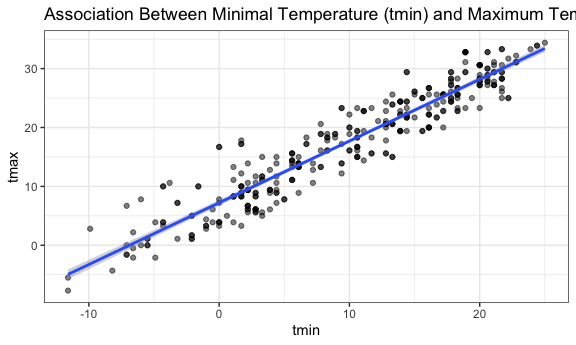
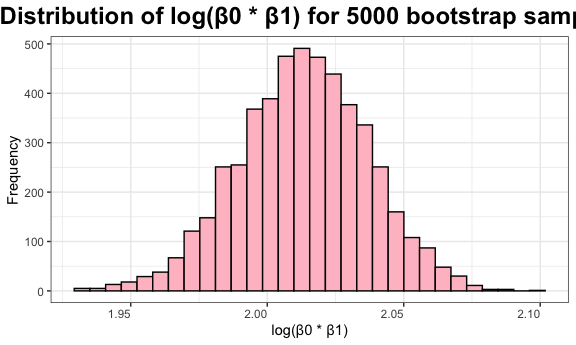
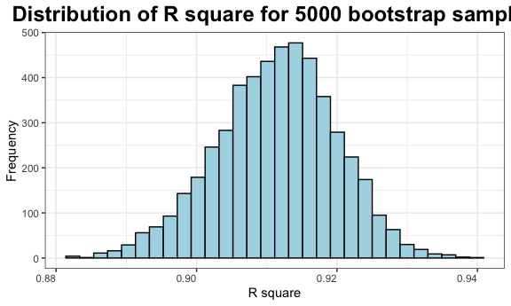
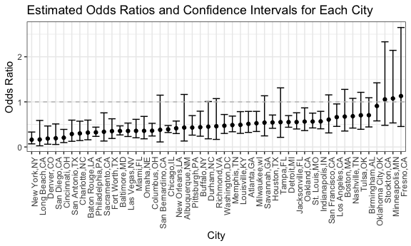

p8105_hw6_fw2394
================
Fang Wang
2024-11-29

# Load libraries and setting up

# Problem 1

## Load data

``` r
weather_df = 
  rnoaa::meteo_pull_monitors(
    c("USW00094728"),
    var = c("PRCP", "TMIN", "TMAX"), 
    date_min = "2017-01-01",
    date_max = "2017-12-31") %>%
  mutate(
    name = recode(id, USW00094728 = "CentralPark_NY"),
    tmin = tmin / 10,
    tmax = tmax / 10) %>%
  select(name, id, everything())
```

    ## using cached file: /Users/fangwang/Library/Caches/org.R-project.R/R/rnoaa/noaa_ghcnd/USW00094728.dly

    ## date created (size, mb): 2024-11-29 14:12:55.635623 (8.667)

    ## file min/max dates: 1869-01-01 / 2024-11-30

*The dataset contains 365 observations and 6 variables.*

## run linear regression between tmax and tmin

``` r
lm(tmax ~ tmin, data = weather_df) |> 
  broom::tidy() |> 
  knitr::kable(digits = 3)
```

| term        | estimate | std.error | statistic | p.value |
|:------------|---------:|----------:|----------:|--------:|
| (Intercept) |    7.209 |     0.226 |    31.847 |       0 |
| tmin        |    1.039 |     0.017 |    61.161 |       0 |

``` r
lm(tmax ~ tmin, data = weather_df) |> 
  broom::glance(model) |> 
  knitr::kable(digits = 3)
```

| r.squared | adj.r.squared | sigma | statistic | p.value |  df |   logLik |      AIC |      BIC | deviance | df.residual | nobs |
|----------:|--------------:|------:|----------:|--------:|----:|---------:|---------:|---------:|---------:|------------:|-----:|
|     0.912 |         0.911 | 2.938 |  3740.663 |       0 |   1 | -910.286 | 1826.572 | 1838.272 | 3133.449 |         363 |  365 |

## write a function to draw a bootstrap sample

``` r
boot_sample = function (df){
  sample_frac(df, replace = TRUE)
}
```

## draw one boot sample and run linear model

``` r
boot_sample(weather_df) |> 
  lm(tmax ~ tmin, data =_) |> 
  broom::tidy() |> 
  knitr::kable(digits = 3)
```

| term        | estimate | std.error | statistic | p.value |
|:------------|---------:|----------:|----------:|--------:|
| (Intercept) |    7.519 |     0.228 |    32.948 |       0 |
| tmin        |    1.032 |     0.017 |    60.302 |       0 |

``` r
# Unless I set seed, otherwise the estimates and slopes are different for each draw.

boot_sample(weather_df) |> # draw 365 observations but may draw the same observations more than once. 
  ggplot(aes(x = tmin, y = tmax)) + 
  geom_point(alpha = .5) +
  stat_smooth(method = "lm") +
  labs(title = "Association Between Minimal Temperature (tmin) and Maximum Temperature (tmax) ")
```

    ## `geom_smooth()` using formula = 'y ~ x'


*The linear regression line has a positive slope, meaning there is a
positive relationship between the minimal temperature and the maximum
temperature. In simpler terms, as the minimum temperature increases, the
maximum temperature tends to increase as well.*

## draw 5000 bootstrap samples

``` r
boot_straps =
  tibble(strap_number = 1:5000) |> 
  mutate(
    strap_samples = map (strap_number, \(i) boot_sample(df = weather_df))
  )
```

## Calculate estimates and rsquare from 5000 bootstrap samples

``` r
bootstrap_results = 
  boot_straps |> 
  mutate(
    models = map(strap_samples, \(df) lm(tmax ~ tmin, data = df) ),
    results_estimates = map(models, broom::tidy),
    rsquare = map(models, broom::glance))|> 
  select(-strap_samples, -models) |> 
  unnest(results_estimates, rsquare) 
```

    ## Warning: `unnest()` has a new interface. See `?unnest` for details.
    ## ℹ Try `df %>% unnest(c(results_estimates, rsquare))`, with `mutate()` if
    ##   needed.

``` r
estimate_rsquare_df = bootstrap_results |> 
  janitor::clean_names() |> 
  select (strap_number, term, estimate, r_squared)
```

*The dataset contains 10000 observations and 4 variables, including
strap_number, term, estimate and r_squared.*

## Change format of the dataset for plotting:

``` r
estimate_rsquare_df_wider = estimate_rsquare_df |> 
  pivot_wider(
    names_from = term, 
    values_from = estimate
  ) |> 
  rename(
    estimate_intercept = `(Intercept)`,  # Wrap (Intercept) in backticks
    estimate_beta = tmin
  )
```

## Plot the distribution of log(β0 \* β1)

``` r
estimate_rsquare_df_wider |> 
  ggplot(aes(x = log(estimate_intercept*estimate_beta)))+
  geom_histogram(bins =30, color = "black", fill = "pink") +
  labs (
    title = "Distribution of log(β0 * β1) for 5000 bootstrap samples",
    x = "log(β0 * β1)",
    y = "Frequency"
  ) +
  theme(axis.text.x = element_text(hjust = 1)) +
  theme(plot.title=element_text(size=18, face="bold"))+
  theme(plot.title = element_text(hjust = 0.5))
```


*The center of the distribution indicates that the product of β₀ and β₁
is most likely around 2.00, and the histogram suggests that this
estimate is consistent with relatively little spread.*

## Plot the distribution of rsquare

``` r
estimate_rsquare_df_wider |> 
  ggplot(aes(x = r_squared))+
  geom_histogram(bins =30, color = "black", fill = "lightblue") +
  labs (
    title = "Distribution of R square for 5000 bootstrap samples",
    x = "R square",
    y = "Frequency"
  ) +
  theme(axis.text.x = element_text(hjust = 1)) +
  theme(plot.title=element_text(size=18, face="bold"))+
  theme(plot.title = element_text(hjust = 0.5))
```


*The model seems to perform consistently well across bootstrap samples,
with an average R² of around 0.91, indicating that it explains 91% of
the variance in the response variable. The narrow distribution and
symmetry suggest reliable model performance, and the relatively high R²
values suggest strong predictive power.*

## calcuate 95% confidence interval for rsquare

``` r
estimate_rsquare_df_wider |> 
  summarize(
    ci_lower = quantile(r_squared, 0.025), 
    ci_upper = quantile(r_squared, 0.975))
```

    ## # A tibble: 1 × 2
    ##   ci_lower ci_upper
    ##      <dbl>    <dbl>
    ## 1    0.894    0.927

*95% confidence interval for rsquare is (0.894, 0.927).*

## calcuate 95% confidence interval for log(β0 \* β1)

``` r
estimate_rsquare_df_wider |> 
summarize(
    ci_lower = quantile(log(estimate_intercept*estimate_beta), 0.025), 
    ci_upper = quantile(log(estimate_intercept*estimate_beta), 0.975))
```

    ## # A tibble: 1 × 2
    ##   ci_lower ci_upper
    ##      <dbl>    <dbl>
    ## 1     1.96     2.06

*95% confidence interval for log(β0_β1) is (1.97, 2.06).*

# Problem 2

## Load and clean data

``` r
homicide = read.csv("./data/homicide-data.csv")|> 
  mutate(city_state = paste(city, state, sep =",")) |> 
  filter(!(city_state%in%c("Dallas,TX", "Phoenix,AZ", "Kansas City,MO", "Tulsa,AL"))) |> 
  mutate(victim_age = as.numeric(victim_age)) |> 
  filter (victim_race %in% c("White", "Black")) |> 
  mutate(
    solved = case_when(
    disposition %in% c("Closed without arrest", "Closed by arrest") ~ 1, # Solved cases
    disposition == "Open/No arrest" ~ 0,                                # Unsolved cases
    TRUE ~ NA_integer_                                                  # Default (optional, NA if unexpected values)
    )
  )
```

    ## Warning: There was 1 warning in `mutate()`.
    ## ℹ In argument: `victim_age = as.numeric(victim_age)`.
    ## Caused by warning:
    ## ! NAs introduced by coercion

*The dataset contains 39693 observations and 14 variables.*

## run glm for Baltimore, MD

``` r
# filter data for Baltimore,MD
baltimore_df = homicide |> 
  filter(city_state == "Baltimore,MD") |> 
  mutate(victim_sex = as.factor (victim_sex),
         victim_race = as.factor (victim_race))

# run generalized linear models
baltimore_model = glm(solved ~ victim_age + victim_sex + victim_race, family = binomial(), data = baltimore_df)

## calculate the odds ratio in the model
model_summary = tidy(baltimore_model, conf.int = TRUE, exponentiate = TRUE)
model_summary
```

    ## # A tibble: 4 × 7
    ##   term             estimate std.error statistic  p.value conf.low conf.high
    ##   <chr>               <dbl>     <dbl>     <dbl>    <dbl>    <dbl>     <dbl>
    ## 1 (Intercept)         1.94    0.174        3.80 1.42e- 4    1.38      2.74 
    ## 2 victim_age          0.995   0.00325     -1.60 1.10e- 1    0.988     1.00 
    ## 3 victim_sexMale      0.355   0.143       -7.26 3.74e-13    0.267     0.468
    ## 4 victim_raceWhite    2.46    0.180        4.99 6.04e- 7    1.73      3.52

## Extract the odds ratio for male vs. female victims

``` r
male_female_odds_ratio = model_summary|> 
  filter(term == "victim_sexMale") |> 
  select(estimate, conf.low, conf.high) |> 
  janitor::clean_names()

male_female_odds_ratio
```

    ## # A tibble: 1 × 3
    ##   estimate conf_low conf_high
    ##      <dbl>    <dbl>     <dbl>
    ## 1    0.355    0.267     0.468

*The estimate of victim_sexMale is 0.355 that indicates the odds of
solving homicides for male victims are 64.5% lower than for female
victims (1−0.355=0.645), holding all other factors constant. Its
confidence Interval (0.267, 0.468) means the true odds are estimated to
be between 0.267 and 0.468. p-value: 3.74×10^(−13), Highly statistically
significant (p\<0.001).*

## run glm for each city

``` r
homicide_cities = homicide|> 
  group_by(city_state) |> 
  nest() |>  # a nested list-column
  mutate(
    models = map(data, ~glm(solved ~ victim_age + victim_sex + victim_race, family = binomial(), data =.x)),
    results = map (models, ~tidy(.x, conf.int = TRUE, exponentiate = TRUE))
  ) |> 
  select (city_state, results) |> 
  unnest(results) |> 
  filter(term == "victim_sexMale") |> 
  select(city_state, term, estimate, conf.low, conf.high) |> 
  janitor::clean_names()
```

    ## Warning: There were 43 warnings in `mutate()`.
    ## The first warning was:
    ## ℹ In argument: `results = map(models, ~tidy(.x, conf.int = TRUE, exponentiate =
    ##   TRUE))`.
    ## ℹ In group 1: `city_state = "Albuquerque,NM"`.
    ## Caused by warning:
    ## ! glm.fit: fitted probabilities numerically 0 or 1 occurred
    ## ℹ Run `dplyr::last_dplyr_warnings()` to see the 42 remaining warnings.

*Homicide_cities contains 47 observations/cities and 5 variables,
including state_city, term, estimate, conf_low and conf_high.*

## plot ORs and Cls

``` r
homicide_cities |> 
  ggplot (aes(x = reorder(city_state, estimate), y = estimate)) +
  geom_point() + 
  geom_errorbar(aes(ymin = conf_low, ymax= conf_high)) + # Add confidence intervals
  geom_hline(yintercept = 1, linetype = 'dashed', color = 'gray') + # Add a dashed line at odds ratio = 1
  labs(x = 'City', y = 'Odds Ratio', title = 'Estimated Odds Ratios and Confidence Intervals for Each City')+  # Labels and title
  theme(axis.text.x = element_text(angle = 90, hjust = 1))  
```


*The plot provides a comparison of the odds ratios for different cities,
allowing us to see which cities have a higher or lower likelihood of
experiencing the event compared to the baseline. Cities like New York,
NY and Long Beach, CA have odds ratios less than 1, which suggests that
solving homicides is less likely in these cities compared to the
reference group. However, cities like Fresno, CA and Minneapolis, MN
have odds ratios greater than 1, meaning that the event is less likely
in these cities compared to the reference group.*
